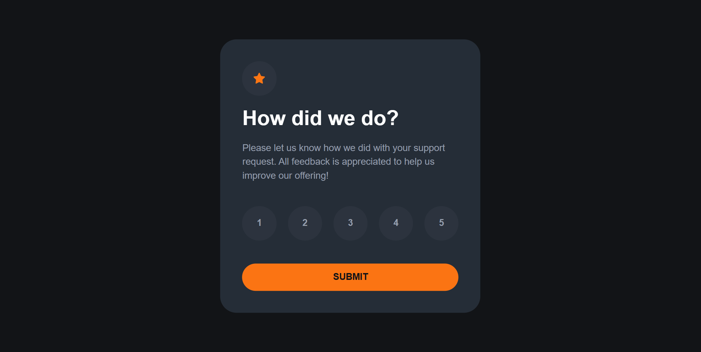

# Frontend Mentor – Interactive Rating Component (React)

This is my solution to the **Interactive Rating Component** challenge from Frontend Mentor.  
The project was built using React and Vite.

## 🔗 Links

[Live Site](https://rating-component-by-evija.netlify.app/)

## 📸 Screenshot

## 🚀 Overview

This project is an interactive rating component where users can:

- Select a rating from 1 to 5
- Submit their selection
- See a thank you message displaying the chosen rating

The UI updates dynamically using conditional rendering without refreshing the page.

## 📚 What I Learned

During this project, I strengthened my understanding of:

- React component structure
- Lifting state up
- Passing props between components
- Handling user events
- Conditional rendering
- Preventing default form behavior
- Project setup with Vite
- Deploying a React app with Netlify

This was my first React project and it helped me understand how React re-renders components when state changes.